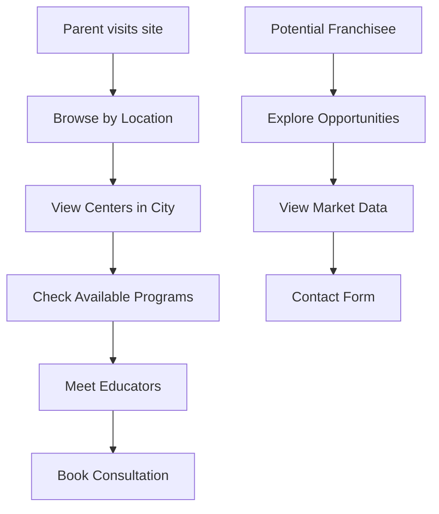

# EDUCATIONAL FRANCHISE SYSTEM ARCHITECTURE
## Team Coordination: Database, UX/UI, Frontend, Content Strategy

---

## 🏗️ **DATA RELATIONSHIPS & ARCHITECTURE**

### **Entity Relationship Diagram**
```
🏙️ LOCATIONS (Gradovi)
    ├── 🏫 CENTERS (1:Many)
    │   ├── 👨‍🏫 EDUCATORS (1:Many - center-employed)
    │   ├── 📚 PROGRAMS (Many:Many)
    │   └── 📸 PHOTOS/CONTENT
    │
    ├── 👨‍🏫 INDEPENDENT EDUCATORS (1:Many - coverage areas)
    ├── 🎯 MARKET DATA (1:1)
    └── 📊 SEO/LOCAL DATA (1:1)

📚 PROGRAMS
    ├── 🏫 AVAILABLE AT CENTERS (Many:Many)
    ├── 👨‍🏫 TAUGHT BY EDUCATORS (Many:Many)
    └── 🎯 AGE GROUP TARGETING (1:Many)

👨‍🏫 EDUCATORS
    ├── 🏫 CENTER AFFILIATION (Many:1 - optional)
    ├── 🏙️ COVERAGE AREAS (Many:Many - for independent)
    ├── 📚 SPECIALIZATIONS (Many:Many)
    ├── 🌟 TESTIMONIALS (1:Many)
    └── 🏆 ACHIEVEMENTS (1:Many)
```

### **Data Flow Architecture**

#### **1. Geographic Hierarchy**
- **Region** → **Location** → **Centers** → **Educators**
- Supports multi-center cities (Belgrade has 3 centers)
- Enables regional franchise management
- SEO optimization per location

#### **2. Program Delivery Model**
- Programs defined centrally but customized per center
- Educators specialize in specific programs
- Age group targeting drives enrollment flows
- Capacity management per center

#### **3. User Journey Data Flow**


---

## 🌐 **WEBSITE INFORMATION ARCHITECTURE**

### **Primary Navigation Structure**
```
🏠 POČETNA
├── 🎓 PROGRAMI
│   ├── Brzočitanje (4-6, 7-10, 11-14)
│   ├── Mentalna aritmetika
│   ├── Tehnike memorije
│   └── Kompletni program
│
├── 🏙️ LOKACIJE
│   ├── Mapa centara
│   ├── [Grad] - Beograd, Novi Sad, Niš...
│   │   ├── Centri u gradu
│   │   ├── Edukatori
│   │   └── Kontakt informacije
│   └── Uskoro - Coming soon lokacije
│
├── 👥 EDUKATORI
│   ├── Svi edukatori
│   ├── Po lokaciji
│   ├── Po specijalizaciji
│   └── Featured instruktori
│
├── 🏪 FRANŠIZA
│   ├── Zašto Srećno učenje
│   ├── Modeli franšize
│   ├── Finansijski kalkulator
│   ├── Kako se priključiti
│   └── Prijava za franšizu
│
├── ℹ️ O NAMA
│   ├── Naša priča
│   ├── Metodologija
│   ├── Rezultati i uspesi
│   └── Tim
│
└── 📞 KONTAKT
    ├── Generalni kontakt
    ├── Rezervacija termina
    └── FAQ
```

### **Page Types & Components**

#### **🏠 Homepage Components**
- **Hero Section**: Value proposition + CTA
- **Location Finder**: Interactive map/dropdown
- **Program Overview**: 3-4 main programs
- **Success Stories**: Results carousel
- **Educator Spotlight**: Featured educators
- **Franchise CTA**: "Pokrenite svoj centar"

#### **🏙️ Location Pages** (`/lokacije/[city]`)
- **City Overview**: Market info, demographics
- **Centers Map**: Interactive map with pins
- **Center Cards**: Photos, contact, programs
- **Local Educators**: Profiles and specializations
- **Enrollment CTA**: "Rezervišite termin"

#### **🏫 Center Detail Pages** (`/centri/[center-slug]`)
- **Center Gallery**: Photos, video tour
- **Programs Offered**: Available programs
- **Meet the Team**: Center educators
- **Schedule & Hours**: Working hours, availability
- **Contact Form**: Direct center contact

#### **👨‍🏫 Educator Profiles** (`/edukatori/[educator-slug]`)
- **Professional Photo & Bio**
- **Certifications & Achievements** 
- **Specializations & Programs**
- **Student Success Metrics**
- **Parent Testimonials**
- **Availability & Contact**

#### **📚 Program Pages** (`/programi/[program-slug]`)
- **Program Overview**: Goals, methodology
- **Age Group Targeting**: Specific benefits
- **Curriculum Details**: Session breakdown
- **Where Available**: Centers offering program
- **Qualified Educators**: Program specialists

#### **🏪 Franchise Hub** (`/fransiza/`)
- **Opportunity Overview**: Market analysis
- **Business Models**: Different franchise types
- **Investment Calculator**: ROI projections  
- **Success Stories**: Existing franchisees
- **Application Process**: Step-by-step guide
- **Application Form**: Multi-step submission

---

## 🎨 **UX/UI DESIGN APPROACH**

### **Design System Principles**

#### **1. Dual Audience Design**
- **Parents**: Trust, results, child safety
- **Franchisees**: Business opportunity, ROI, support

#### **2. Visual Hierarchy**
```
PRIMARY BRAND COLORS:
- 🔵 Trust Blue (#2563EB) - Professional credibility
- 🟢 Growth Green (#10B981) - Success, progress
- 🟡 Joy Yellow (#F59E0B) - Child-friendly, optimism
- ⚪ Clean White (#FFFFFF) - Clarity, space

TYPOGRAPHY HIERARCHY:
- H1: 32px-48px Bold - Page titles
- H2: 24px-32px Semibold - Section headers  
- H3: 20px-24px Medium - Card titles
- Body: 16px Regular - Content text
- Caption: 14px Regular - Support text
```

#### **3. Component Library**

##### **Location Components**
- **City Card**: Photo, stats, status badge
- **Center Card**: Gallery, contact, programs
- **Map Component**: Interactive with filters
- **Educator Card**: Photo, specializations, CTA

##### **Content Components**  
- **Program Card**: Icon, description, age groups
- **Success Metric**: Number + description
- **Testimonial**: Quote + author info
- **Achievement Badge**: Icon + title

##### **Form Components**
- **Location Selector**: Dropdown with search
- **Multi-Step Form**: Progress indicator
- **Contact Form**: Validation + success states
- **Calendar Booking**: Availability slots

### **Mobile-First Responsive Strategy**

#### **Breakpoints**
- **Mobile**: 320px-768px (Primary design target)
- **Tablet**: 768px-1024px (Adaptation layer)
- **Desktop**: 1024px+ (Enhancement layer)

#### **Mobile UX Priorities**
1. **Location Finding**: GPS-based suggestions
2. **Quick Contact**: Call-to-action buttons
3. **Program Cards**: Swipeable carousel
4. **Educator Profiles**: Compact, scannable
5. **Franchise Form**: Single-column, chunked

#### **Child-Friendly Elements**
- **Rounded Corners**: Soft, safe feeling
- **Playful Icons**: Age-appropriate imagery
- **Color Psychology**: Warm, encouraging tones
- **Interactive Elements**: Hover states, micro-animations
- **Clear Navigation**: Simple, intuitive paths

---

## 🔍 **SEO & DISCOVERABILITY STRATEGY**

### **Local SEO Architecture**

#### **Location-Based URLs**
```
/lokacije/beograd
/lokacije/novi-sad
/centri/beograd-centar
/centri/novi-sad-dunavska
/edukatori/marija-petrovic-beograd
```

#### **Schema Markup Strategy**
```json
{
  "@type": "EducationalOrganization",
  "name": "Srećno učenje Beograd Centar",
  "address": {
    "@type": "PostalAddress",
    "streetAddress": "Knez Mihailova 50",
    "addressLocality": "Beograd",
    "addressCountry": "RS"
  },
  "geo": {
    "@type": "GeoCoordinates", 
    "latitude": 44.7866,
    "longitude": 20.4489
  },
  "hasOfferCatalog": {
    "@type": "OfferCatalog",
    "name": "Edukacijski programi"
  }
}
```

#### **Content SEO Strategy**

##### **Location Pages**
- Title: "Brzočitanje za decu u [Grad] | Srećno učenje"
- Meta: "Najbolji centri za brzočitanje i mentalne veštine u [Grad]. Sertifikovani edukatori, dokazane metode. Rezervišite besplatan čas!"
- Keywords: "[grad] brzočitanje deca", "mentalna aritmetika [grad]"

##### **Educator Pages**  
- Title: "[Ime] - Instruktor brzočitanja | [Grad]"
- Meta: "Upoznajte [Ime], sertifikovanog instruktora sa X godina iskustva u [specijalizacija]. Rezervišite čas danas!"

##### **Program Pages**
- Title: "[Program] za decu | Srećno učenje metodologija"
- Meta: "[Program] program za decu uzrasta X-Y. Dokazane tehnike, brzi rezultati. Dostupno u X gradova."

### **Franchise Discovery Optimization**

#### **Business Opportunity SEO**
```
"franšiza obrazovanje srbija"
"investicija u školu"
"biznis prilika deca"
"edukacijski centar franšiza"
```

#### **Local Business Keywords**
```
"pokretanje škole [grad]"
"investicija obrazovanje [region]"
"franšiza centar učenja"
```

---

## 📱 **MOBILE EXPERIENCE DESIGN**

### **Mobile User Journeys**

#### **Parent Journey (Mobile)**
1. **Landing**: Hero with location finder
2. **Location Select**: GPS + dropdown
3. **Center Cards**: Swipe carousel
4. **Program Details**: Expandable sections  
5. **Educator Profiles**: Quick facts
6. **Contact**: One-tap call, form

#### **Franchisee Journey (Mobile)**
1. **Opportunity Landing**: Value props
2. **Calculator**: Simple inputs
3. **Business Model**: Cards overview
4. **Application**: Multi-step, saved progress

### **Mobile Components**

#### **Navigation**
- **Hamburger Menu**: Full-screen overlay
- **Sticky CTA**: Floating action button
- **Breadcrumbs**: Swipeable path

#### **Cards & Lists**
- **Location Cards**: Photo, title, quick stats
- **Educator Cards**: Photo, name, 1-line bio, CTA
- **Program Cards**: Icon, title, age range, arrow

#### **Forms & Interactions**
- **Location Picker**: Map + list toggle
- **Contact Forms**: Large touch targets
- **Image Galleries**: Swipe with dots
- **Testimonials**: Auto-scrolling carousel

---

## 🎯 **USER JOURNEY MAPPING**

### **Parent User Journey**

#### **Discovery Phase**
- **Need**: Child struggling with reading/focus
- **Search**: "brzočitanje za decu [grad]"
- **Landing**: Program-specific or location page
- **Browse**: Compare programs and locations

#### **Evaluation Phase**  
- **Center Research**: Photos, reviews, programs
- **Educator Profiles**: Qualifications, experience
- **Success Stories**: Other parents' testimonials
- **Pricing**: Program costs, payment options

#### **Decision Phase**
- **Contact**: Call center or fill form
- **Consultation**: Meet educator, assess child
- **Enrollment**: Choose program and schedule

#### **Experience Phase**
- **Onboarding**: First lessons, expectations
- **Progress**: Regular updates, parent meetings
- **Results**: Measurable improvements
- **Advocacy**: Testimonials, referrals

### **Potential Franchisee Journey**

#### **Discovery Phase**
- **Trigger**: Career change, investment opportunity
- **Research**: "franšiza obrazovanje", industry analysis
- **Landing**: Franchise opportunity page
- **Overview**: Business model, requirements

#### **Evaluation Phase**
- **Market Analysis**: Location-specific data
- **Financial Planning**: ROI calculator, investment needs
- **Success Stories**: Existing franchisee interviews
- **Support Structure**: Training, marketing, ongoing help

#### **Application Phase**
- **Initial Contact**: Interest form submission
- **Qualification**: Financial and experience review
- **Application**: Detailed multi-step form
- **Interview Process**: Video calls, in-person meetings

#### **Onboarding Phase**
- **Agreement**: Contract signing, payments
- **Training**: Methodology, business operations
- **Setup**: Location, staff, marketing launch
- **Launch**: Grand opening, marketing support

### **Educator Career Journey**

#### **Discovery Phase**
- **Background**: Education professional seeking growth
- **Research**: "instruktor brzočitanje posao"
- **Landing**: Careers page or educator profiles
- **Learn**: Methodology, certification process

#### **Application Phase**
- **Requirements**: Qualifications, experience check
- **Application**: Professional background, motivations
- **Assessment**: Skills evaluation, child interaction
- **Interview**: Values alignment, growth potential

#### **Development Phase**
- **Certification**: Methodology training program
- **Mentorship**: Shadow experienced educators
- **Practice**: Supervised teaching sessions
- **Qualification**: Assessment and certification

#### **Career Growth**
- **Placement**: Assignment to center/region
- **Performance**: Student results, parent feedback
- **Advancement**: Senior roles, mentor positions
- **Recognition**: Achievement badges, success stories

---

## 📊 **SUCCESS METRICS & KPIs**

### **Website Performance**
- **Conversion Rates**: Form submissions per visit
- **Location Engagement**: Time on location pages
- **Mobile Experience**: Mobile completion rates
- **SEO Performance**: Local ranking positions

### **User Experience**
- **Parent Journey**: Discovery to enrollment time
- **Franchisee Interest**: Calculator to application rate
- **Educator Interest**: Profile views to applications
- **Content Engagement**: Page depth, return visits

### **Business Impact**
- **Lead Generation**: Quality inquiries per month
- **Geographic Coverage**: Active locations growth
- **Franchise Development**: New center openings
- **Brand Awareness**: Search volume, brand mentions

---

*This architecture serves as the foundation for a coordinated development approach across database, frontend, content, and marketing teams. Each component is designed for scalability and optimal user experience.*